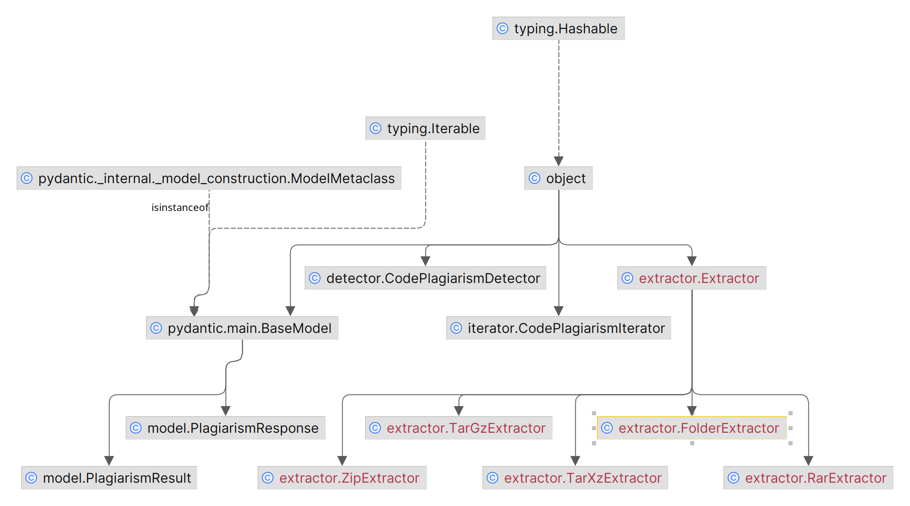

# C/C++ Plagiarism Detector  (Web-APP)

An application that detects plagiarism in C/C++ code. The application is built using FastAPI and utilizes a series of preprocessing steps and fingerprint generation techniques to assess the likeness between the code snippets. 

This application used for OOP Final Project.

### Diagrams
